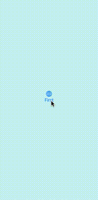

# basic-screen-transition



```swift
import SwiftUI

@main
struct TrySwiftUIApp: App {
    var body: some Scene {
        WindowGroup {
            RoutingView()
        }
    }
}

struct RoutingView: View {

    @State private var shown = false

    var body: some View {
        ZStack {
            if shown {
                SecondScreen() {
                    withAnimation {
                        shown.toggle()
                    }
                }
            } else {
                FirstScreen() {
                    withAnimation {
                        shown.toggle()
                    }
                }
            }
        }
    }
}

struct FirstScreen: View {

    private let toSecoundScreen: () -> Void

    init(callback: @escaping () -> Void) {
        toSecoundScreen = callback
    }

    var body: some View {
        ZStack {
            Rectangle()
                .fill(Color.mint)
                .opacity(0.2)
                .frame(minWidth: 0, maxWidth: .infinity)
            VStack{
                Image(systemName: "globe")
                    .imageScale(.large)
                    .foregroundColor(.accentColor)
                Button {
                    toSecoundScreen()
                } label: {
                    Text("First")
                }
            }
        }
        .edgesIgnoringSafeArea(.all)
    }
}

struct SecondScreen: View {

    private let toBackScreen: () -> Void

    init(callback: @escaping () -> Void) {
        toBackScreen = callback
    }

    var body: some View {
        ZStack {
            Rectangle()
                .fill(Color.pink)
                .opacity(0.2)
                .frame(minWidth: 0, maxWidth: .infinity)
            VStack{
                Image(systemName: "flag.checkered.2.crossed")
                    .imageScale(.large)
                    .foregroundColor(.accentColor)
                Button {
                    toBackScreen()
                } label: {
                    Text("Secound")
                }
            }
        }
        .edgesIgnoringSafeArea(.all)
    }
}
```
