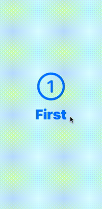
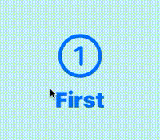

# routing-screen-transition



```swift
import SwiftUI

@main
struct TrySwiftUIApp: App {
    var body: some Scene {
        WindowGroup {
            RoutingView()
        }
    }
}

enum Screen {
    case none
    case first
    case second
    case third
}

struct RoutingView: View {

    @State private var currentScreen: Screen = .first
    @State private var nextScreen: Screen = .none

    private func screenView(screen: Screen,
                            toNextScreen: @escaping (_ screen: Screen) -> Void = { _ in }) -> AnyView {
        switch screen {
        case .none: return AnyView(EmptyView())
        case .first: return AnyView(FirstScreen(toNextScreen))
        case .second: return AnyView(SecondScreen(toNextScreen))
        case .third: return AnyView(ThirdScreen(toNextScreen))
        }
    }

    private let duration = 1.0

    var body: some View {
        ZStack {
            screenView(screen: currentScreen) { next in
                withAnimation(.linear(duration: duration)) {
                    nextScreen = next
                }
                DispatchQueue.main.asyncAfter(deadline: .now() + duration) {
                    currentScreen = next
                    nextScreen = .none
                }
            }
            if nextScreen != .none {
                screenView(screen: nextScreen)
            }
        }
    }
}

struct FirstScreen: View {

    private let toNextScreen: (_ screen: Screen) -> Void

    init(_ callback: @escaping (_ screen: Screen) -> Void) {
        toNextScreen = callback
    }

    var body: some View {
        ZStack {
            Rectangle()
                .fill(Color.mint)
                .opacity(0.2)
                .frame(minWidth: 0, maxWidth: .infinity)
            VStack{
                Image(systemName: "1.circle")
                    .resizable()
                    .frame(width: 100, height: 100)
                    .foregroundColor(.accentColor)
                Button {
                    toNextScreen(.second)
                } label: {
                    Text("First")
                        .font(.system(size: 50, weight: .black, design: .default))
                }
            }
        }
        .background(.white)
        .edgesIgnoringSafeArea(.all)
    }
}

struct SecondScreen: View {

    private let toNextScreen: (_ screen: Screen) -> Void

    init(_ callback: @escaping (_ screen: Screen) -> Void) {
        toNextScreen = callback
    }

    var body: some View {
        ZStack {
            Rectangle()
                .fill(Color.pink)
                .opacity(0.2)
                .frame(minWidth: 0, maxWidth: .infinity)
            VStack{
                Image(systemName: "2.circle")
                    .resizable()
                    .frame(width: 100, height: 100)
                    .foregroundColor(.accentColor)
                Button {
                    toNextScreen(.third)
                } label: {
                    Text("Secound")
                        .font(.system(size: 50, weight: .black, design: .default))
                }
            }
        }
        .background(.white)
        .edgesIgnoringSafeArea(.all)
    }
}

struct ThirdScreen: View {

    private let toNextScreen: (_ screen: Screen) -> Void

    init(_ callback: @escaping (_ screen: Screen) -> Void) {
        toNextScreen = callback
    }

    var body: some View {
        ZStack {
            Rectangle()
                .fill(Color.yellow)
                .opacity(0.2)
                .frame(minWidth: 0, maxWidth: .infinity)
            VStack{
                Image(systemName: "3.circle")
                    .resizable()
                    .frame(width: 100, height: 100)
                    .foregroundColor(.accentColor)
                Button {
                    toNextScreen(.first)
                } label: {
                    Text("Third")
                        .font(.system(size: 50, weight: .black, design: .default))
                }
            }
        }
        .background(.white)
        .edgesIgnoringSafeArea(.all)
    }
}
```

## Issues

- ボタンを連打するとチラついてしまう

  
